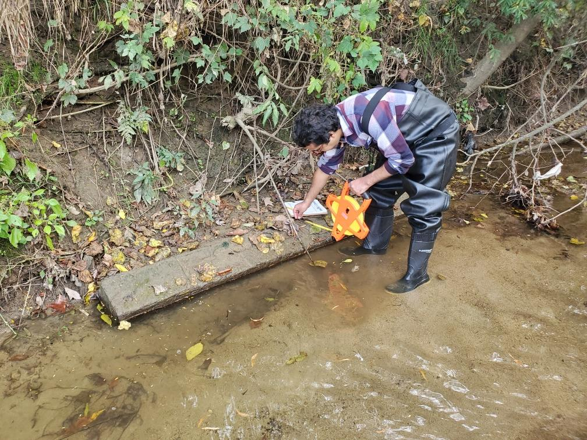
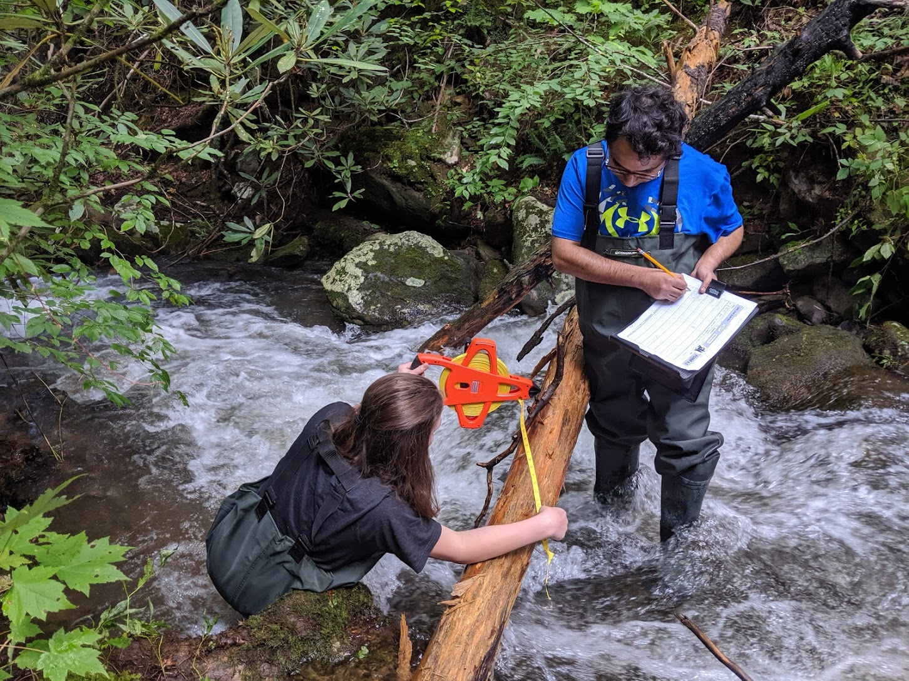
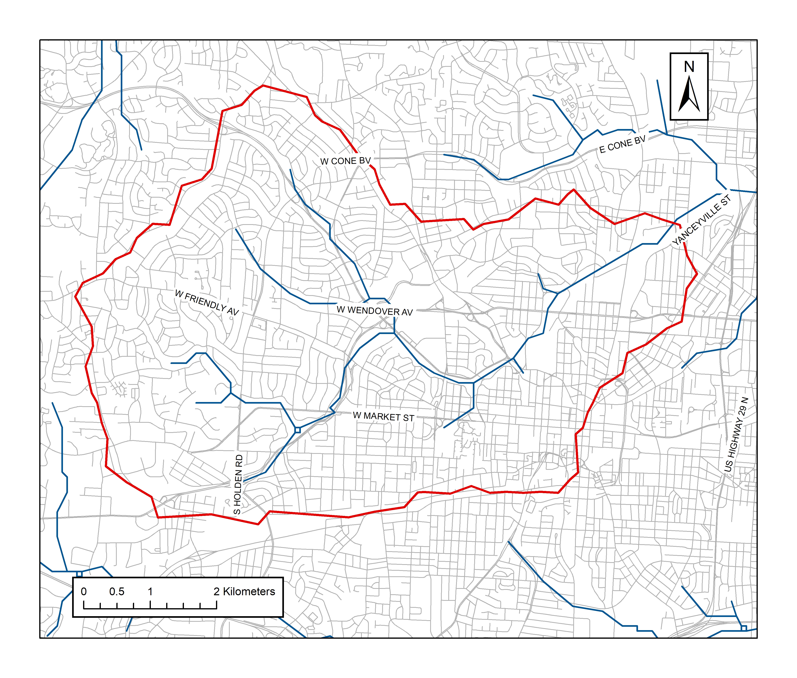

\
 <i class="fas fa-project-diagram "></i> These are some of the projects that I was/am involved in either in school as a student or in my professional life. 
 
\

# North Buffalo Creek Pilot Study

*Photo: Raj collecting data in North Buffalo Creek*

I collected data during a pilot study of dead large wood (< 1 m in length and < 10 cm diameter) at Greensboro’s North Buffalo Creek on October 23 and 24, 2020. Three different reaches (sites) of the creek were selected and studied: Latham Park, Audubon Preserve, and Lake Daniel Park. Two hundred meters of each reach was surveyed by following Washington State Large Woody Debris Survey Protocol. 

Some of the metrics that were evaluated were: frequency, and volume of wood at each site (descriptive statistics), whether the frequencies and volume of large wood at each site are statistically significant from each other **(Chi-square test, and Kruskal Wallis test)**. [Click here](https://rpubs.com/rajesh1/701224){target="_blank"} to learn more about it. 

---

# Great Smoky Mountains

Wood surveys in July and August of 2019 were conducted on four reaches in two watershed systems that were affected by the 2016 Chimney Tops 2 wildfire in Great Smokey Mountains National Park in Tennessee, USA. The goal of the study was to understand the relative significance of the burned wood in the total wood budget in streams. 

After the field survey, I entered the data into an Excel sheet and performed data analysis. I also helped write the results of the project. Our study suggested that fire provides major influx of woody debris into streams. The manuscript of the research is under review for a scientific publication. 

 *Photo: Raj and Lena collecting data in Smokey Mountain Natioanl Park*

---

# Hill Slope Hydrology
I have tried to list here all the projects that I have worked on including big projects, class projects or even small trivial things that I did during my school time.

\

## TIN Map

Watershed is an area of the land that drains into a common outlet (pour point). Triangulated Irregular Networks are useful in visualizing terrain of the earth. I created a Triangular Irregular Network of my study site of the North Buffalo Creek using ArcMap 10.5.Following steps was used: 
\
Two feet interval contour interval of the Guilford county, downloaded from the North Carolina State GIS, was used during the process.  Conversion of contour line file into Digital Elevation Model (DEM). Used fill tool to fill the small unnatural potholes of the surface. The fill tool smoothens out the surface. The flow direction tool was utilized to determine the direction of the flow from each raster cell. Flow accumulation tool was used to capture flow of the raster file. The outlet point (pour point) was used to capture the flow of the file. The intersection of North Buffalo Creek in Yanceyville street of Greensboro was identified as the pour point. The watershed tool was used to create the outline of the watershed. The raster was then converted to shapefile. I then used convert raster to TIN to create TIN map of the study site.  <a href = "https://drive.google.com/file/d/10B-t5N9NMjMJyrRT8TaFGqQKlTnC8oLA/view?usp=sharing" target= "_blank">  Click here</a> to view the image. 

---

## Introduction
sed fill tool to fill the small unnatural potholes of the surface. The fill tool smoothens out the surface. The flow direction tool was utilized to determine the direction of the flow from each raster cell. Flow accumulation tool was used to capture flow of the raster file. The outlet point (pour point) was used to capture the flow of the file. The intersection of North Buffalo Creek in Yanceyville street of Greensboro was identified as the pour point. The watershed tool was used to create the outline of the watershed. The raster was then converted to shapefile.
\
\
\
\
\

---

# 3D Surface
Two feet interval contour interval of the Guilford county, downloaded from the North Carolina State GIS, was used during the process.  Conversion of contour line file into Digital Elevation Model (DEM). Used fill tool to fill the small unnatural potholes of the surface. The fill tool smoothens out the surface. The flow direction tool was utilized to determine the direction of the flow from each raster cell. Flow accumulation tool was used to capture flow of the raster file. The outlet point (pour point) was used to capture the flow of the file. The intersection of North Buffalo Creek in Yanceyville street of Greensboro was identified as the pour point. The watershed tool was used to create the outline of the watershed. The raster was then converted to shapefile. I then used convert raster to TIN to create TIN map of the study site. 

# 3D surface
Two feet interval contour interval of the Guilford county, downloaded from the North Carolina State GIS, was used during the process.  Conversion of contour line file into Digital Elevation Model (DEM). Used fill tool to fill the small unnatural potholes of the surface. The fill tool smoothens out the surface. The flow direction tool was utilized to determine the direction of the flow from each raster cell. Flow accumulation tool was used to capture flow of the raster file. The outlet point (pour point) was used to capture the flow of the file. The intersection of North Buffalo Creek in Yanceyville street of Greensboro was identified as the pour point. The watershed tool was used to create the outline of the watershed. The raster was then converted to shapefile. I then used convert raster to TIN to create TIN map of the study site. 

# 3D Surface
Two feet interval contour interval of the Guilford county, downloaded from the North Carolina State GIS, was used during the process.  Conversion of contour line file into Digital Elevation Model (DEM). Used fill tool to fill the small unnatural potholes of the surface. The fill tool smoothens out the surface. The flow direction tool was utilized to determine the direction of the flow from each raster cell. Flow accumulation tool was used to capture flow of the raster file. The outlet point (pour point) was used to capture the flow of the file. The intersection of North Buffalo Creek in Yanceyville street of Greensboro was identified as the pour point. The watershed tool was used to create the outline of the watershed. The raster was then converted to shapefile. I then used convert raster to TIN to create TIN map of the study site. 

# 3D surface
Two feet interval contour interval of the Guilford county, downloaded from the North Carolina State GIS, was used during the process.  Conversion of contour line file into Digital Elevation Model (DEM). Used fill tool to fill the small unnatural potholes of the surface. The fill tool smoothens out the surface. The flow direction tool was utilized to determine the direction of the flow from each raster cell. Flow accumulation tool was used to capture flow of the raster file. The outlet point (pour point) was used to capture the flow of the file. The intersection of North Buffalo Creek in Yanceyville street of Greensboro was identified as the pour point. The watershed tool was used to create the outline of the watershed. The raster was then converted to shapefile. I then used convert raster to TIN to create TIN map of the study site. 

# 3D Surface
Two feet interval contour interval of the Guilford county, downloaded from the North Carolina State GIS, was used during the process.  Conversion of contour line file into Digital Elevation Model (DEM). Used fill tool to fill the small unnatural potholes of the surface. The fill tool smoothens out the surface. The flow direction tool was utilized to determine the direction of the flow from each raster cell. Flow accumulation tool was used to capture flow of the raster file. The outlet point (pour point) was used to capture the flow of the file. The intersection of North Buffalo Creek in Yanceyville street of Greensboro was identified as the pour point. The watershed tool was used to create the outline of the watershed. The raster was then converted to shapefile. I then used convert raster to TIN to create TIN map of the study site.  

# 3D surface
Two feet interval contour interval of the Guilford county, downloaded from the North Carolina State GIS, was used during the process.  Conversion of contour line file into Digital Elevation Model (DEM). Used fill tool to fill the small unnatural potholes of the surface. The fill tool smoothens out the surface. The flow direction tool was utilized to determine the direction of the flow from each raster cell. Flow accumulation tool was used to capture flow of the raster file. The outlet point (pour point) was used to capture the flow of the file. The intersection of North Buffalo Creek in Yanceyville street of Greensboro was identified as the pour point. The watershed tool was used to create the outline of the watershed. The raster was then converted to shapefile. I then used convert raster to TIN to create TIN map of the study site. 

