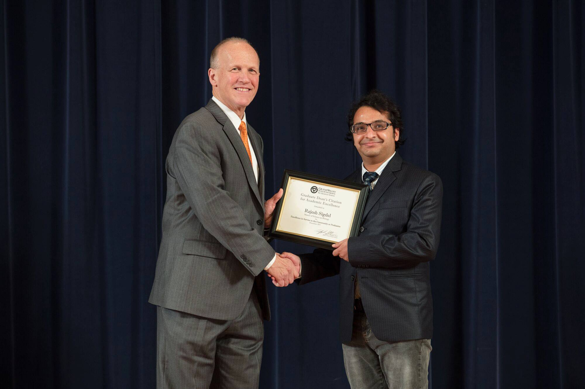
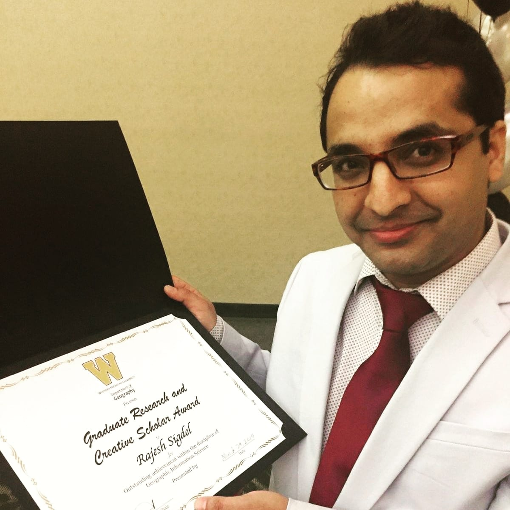

 
 

# Education

---

Ph.D in Geography - University of North Carolina at Greensboro, Greensboro, NC -Expected Graduation: 2022  
MS in Geography - Western Michigan University, Kalamazoo, MI - 2019  
MS in Biology - Grand Valley State University, Allandale, MI - 2017  
Bsc. in Environmental Science - Tribhuvan University, Kathmandu, Nepal - 2014

\

# Honors and Awards

---

1st Place Winner in Great Lakes AAG Masters Degree Student Research Competition: Presented objectives, methods, results, and conclusion of the research within 20 minutes.

2nd Place Winner in 3 Minute Thesis Competition (2019): Western Michigan University: Presented objectives, methods, results, and conclusion of the research within 3 minutes

Graduate Research and Creative Scholar Award (2019) by Department of Geography, Environment, and Tourism of Western Michigan University: For outstanding contribution to the field of GIS 

Graduate Dean Citation of Academic Excellence (2017) by Grand Valley State University: For Excellence in Service to the Community or Profession
  
Near East and South Asia scholarship program (2011-2012), sponsored by the Fulbright Commission of Nepal, and funded by the US Department of State

\

Note: I was selected to participate in the National Water Center Innovators Program Summer Institute of 2020 (June 8 - July 23, 2020) at the University of Alabama. The Summer Institute provides an opportunity to collaborate with national leaders in hydrology, modeling, and decision support, and with top graduate students in the field. The program was canceled due to COVID-19.

\
   
---

\

This video was taken by Graduate Student Association of Western Michigan University during 3MT competition. I was awarded with second prize in the competition. Kindly note that I have improved my accent since then `r emo::ji("smile")` 

\

   <iframe width="400" height="300" src="https://www.youtube.com/embed/eomfFC7JtsQ" frameborder="0" allowfullscreen></iframe>  
   Click play button to watch the video

---

---

 

---

---
