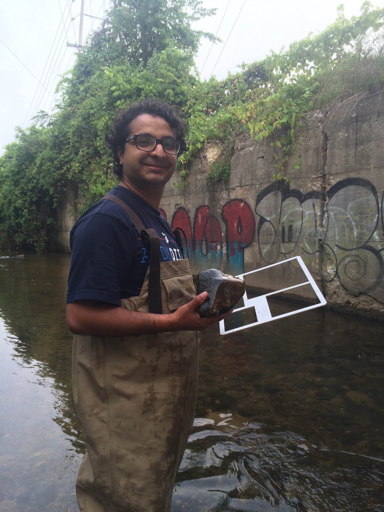

# **Rajesh Sigdel**

I am a Ph.D student at the University of North Carolina at Greensboro in the department of Geography. My research interest lies at the intersection of the human and environment. I am particularly interested in understanding the how river science...... 

## Tools in my toolbox

1. <i class="fas fa-globe-americas"></i> ArcGIS 

2. <i class="fas fa-database"></i> Structured Query Language

3. <i class="fab fa-r-project"></i> R for Statistical Analysis

4. <i class="fab fa-python"></i> Python

---

### Membership 
*   Water Specialty Group of American Association of Geographers, 
*   Data Visualization Society

---

I also actively blog about Data  Analytics and Data Science in [Medium](https://medium.com/@r_sigdel){target="_blank"}
\
\
Academic CV (academic Jobs): 
<a href = "https://drive.google.com/file/d/1rKsheeQYrtmw8zmlGQzD7wpNtTadm7Xe/view?usp=sharing" target= "_blank"> Click here to view </a>  
Resume Created from R Markdown: <a href="https://drive.google.com/file/d/1AV7UYPcbSndFglXX2DT5EADWk6WZkSi2/view?usp=sharing" target= "_blank"> Click here to view </a> 

### River and Raj

</a>

This website is created using <i class="fab fa-r-project"></i> and is hosted in <i class="fa fa-github" aria-hidden="true"></i>
