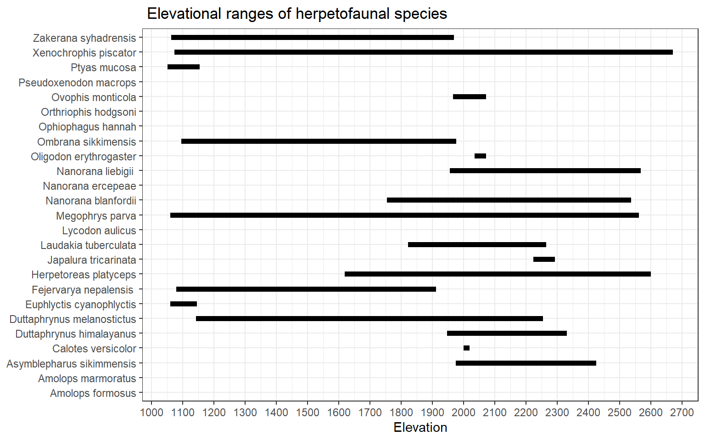

*Do you want to learn how to code in R?* Here are some of the tutorials that you can follow step by step to help you in your journey of learning R. 

\

# R pubs

These tutorials are published in Rpubs. Rpubs is a platform by Rstudio where you can publish your Markdown document on the internet with a click of a button. 

## Elevation Range of species

```{r, out.width="70%", fig.align='center'}

```


Have you every wondered how to Gantt Chart in R that shows the elevational rage of different species? [Click here](https://rpubs.com/rajesh1/elevationGraph){target="_blank} to learn more about how to convert sparse matrix into tidy format and create Gantt Chart in R. 

## Understanding Correlation  
Have you every wondered how to Gantt Chart in R that shows the elevational rage of different species? [Click here](https://rpubs.com/rajesh1/elevationGraph){target="_blank} to learn more about how to convert sparse matrix into tidy format and create Gantt Chart in R. 


## Geojason Maps 
Have you every wondered how to Gantt Chart in R that shows the elevational rage of different species? [Click here](https://rpubs.com/rajesh1/elevationGraph){target="_blank} to learn more about how to convert sparse matrix into tidy format and create Gantt Chart in R. 